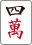
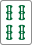

# もっと麻雀が楽しくなる本

## 前書き
皆さんが麻雀で楽しいと感じるときはいつでしょうか。やはりロンやツモで上がったときが一番楽しいのではないでしょうか。（そうでない方はごめんなさい）  
この本は麻雀に入門したばかりの方に向けて、上がりの回数を増やすための技術を提示するものです。  
本書の内容をもとに、より多くの楽しい経験を積んでいただければ幸いです。  

---

## 本書で扱う内容

#### 攻撃面

* 牌理（一番早くテンパイするために捨てる牌を選ぶ技術）
* 最初に覚えると良い役（立直、飜牌、断幺）

## 本書に出てこない内容（需要があれば別の機会に）

#### 攻撃面

* 役作り（上がり点数を一番高くするために捨てる牌を選ぶ技術）
* 鳴き（ポン、チーを実行するべきか判断する技術）

#### 守備面

* ベタオリ（リーチされた際にリーチ者からロンされにくい牌を選択する技術）
* 押し引き（リーチされた際に攻めるべきか守るべきかを判断する技術）

---

## 目次

### 牌理
1. 上がりの形
2. 上がり牌の待ちの種類
3. シャンテン数とは
4. 有効牌の考え方
5. 強いターツと弱いターツ、フォロー牌
6. 迷ったら両面を作ろう
7. 1シャンテン→テンパイが難しい
8. 1シャンテン時は対子は2つ
9. 5ブロックを作ろう
10. 何切る問題で復習

### 最初に覚えると良い役
1. 立直
2. 飜牌
3. 断幺

### 実践
1. アプリで復習
2. 練習対局（手配オープンで同卓者と相談しながら）

### 付録
1. 用語の定義一覧
2. 役一覧

---

## 牌理
## 上がりの形
#### 牌の組み合わせ方
麻雀は牌を組み合わせて上がりの形を作るゲームです。基本は3枚を1グループとして組み合わせます。グループの種類は、順子と刻子の2種類があります。  
「順子または刻子4グループ(=メンツ)」と「同じ種類の牌2枚（=頭）」を揃えると上がりの形となります。

#### 数字を3つ連番で集める 順子（シュンツ）
同じ種類で3つ続きの数字の牌を集めたグループです。
違う種類を含んだり、数字が一巡するものは順子とは認められません。

* OKな例

    
    
    
    すべてが萬子で、なおかつ4,5,6と3つ続きの数字の牌のためOK。

    
    
    
    すべてが索子で、なおかつ1,2,3と3つ続きの数字の牌ためOK。

* NGな例

    
    
    
    2,3,4と3つ続きの数字だが、萬子と筒子が混ざっているためNG

    
    
    
    すべて萬子だが、数字が9から1へ一巡している。9と1はつながらないためNG

    
    
    
    字牌では順子はできないためNG

    
    
    
    字牌では順子はできないためNG

#### 同じ牌を3つ集める 刻子（コーツ）

種類、数字が同じ牌を3つ集めたグループです。
数牌、字牌どちらでも成立します。

* OKな例

    
    
    

    
    
    

    
    
    

    
    
    

#### 上がりの形の例

* 例

    
    
    
    メンツ（順子）
    
    
    
    メンツ（刻子）
    
    
    
    メンツ（順子）
    
    
    
    メンツ（刻子）
    
    
    頭

## 節のまとめ
* 上がりの形は「順子または刻子4グループ(=メンツ)」と「同じ種類の牌2枚（=頭）」
* 順子は数字を順番に並べたもの
* 刻子は同じ牌を3つ揃えたもの

---

## 上がり牌の待ちの種類
あと1種類の牌が加われば上がりの形ができあがる形のことを「待ち」または「テンパイ」、上がりの形になる牌のことを「待ち牌」と言います。  
待ちの形は様々ありますが、基本の形は6種類あります。形により上がりやすさが異なります。

* 両面待ち（リャンメン待ち）

    
    
    
    メンツ
    
    
    
    メンツ
    
    
    
    メンツ
    
    
    頭
    
    
    両面待ち

    
    か
    
    がくれば4つ目のメンツ（順子）が完成し、上がりの形になります。

* ノベタン待ち

    
    
    
    メンツ
    
    
    
    メンツ
    
    
    
    メンツ
    
    
    
    
    ノベタン待ち

    
    か
    
    がくれば頭が完成し、上がりの形になります。

* 双碰待ち（シャンポン待ち、シャボ待ち）

    
    
    
    メンツ
    
    
    
    メンツ
    
    
    
    メンツ
    
    
    双碰待ち
    
    
    双碰待ち

    
    か
    
    がくれば4つ目のメンツ（刻子）が完成し、上がりの形になります。

* 嵌張待ち（カンチャン待ち）

    
    
    
    メンツ
    
    
    
    メンツ
    
    
    
    メンツ
    
    
    頭
    
    
    嵌張待ち

    
    がくれば4つ目のメンツ（順子）が完成し、上がりの形になります。

* 辺張待ち（ペンチャン待ち）

    
    
    
    メンツ
    
    
    
    メンツ
    
    
    
    メンツ
    
    
    頭
    
    
    辺張待ち

    
    がくれば4つ目のメンツ（順子）が完成し、上がりの形になります。

* 単騎待ち（タンキ待ち）

    
    
    
    メンツ
    
    
    
    メンツ
    
    
    
    メンツ
    
    
    
    メンツ
    
    単騎待ち

    
    がくれば頭が完成し、上がりの形になります。

### 待ちの上がりやすさ
待ちによって上がりやすさが変わります。  
待ち牌の枚数が多いほど上がりやすいです。  
両面待ちが一番上がりやすいので、両面を優先して残すようにしましょう。

|待ちの種類|待ち牌の種類と枚数|
|:---|:---|
|両面待ち|2種類8枚|
|ノベタン待ち|2種類6枚|
|双碰待ち|2種類4枚|
|嵌張待ち|1種類4枚|
|辺張待ち|1種類4枚|
|単騎待ち|1種類3枚|

## 節のまとめ
* 後1枚で上がれる状態のことを「テンパイ」「待ち」と呼ぶ
* 上がりの形になる牌のことを「待ち牌」と言う
* 待ちの形には両面、ノベタン、双碰、嵌張、辺張、単騎がある。両面が一番待ち牌が多く上がりやすい

---

## シャンテン数とは
「待ち」「テンパイ」になるまでに必要な牌の枚数のことです。

* 1シャンテンの例

    
    
    
    
    
    
    
    
    
    
    
    

完成していないメンツ・頭が2つあり、

か

のどちらか1枚が来ればテンパイになります。  
あと1枚加わればテンパイになるため、上の形は1シャンテンとなります。

* 2シャンテンの例

    
    
    
    
    
    
    
    
    
    
    

完成していないメンツ・頭が3つあり、

か

か

のうち、いずれかか2枚が来ればテンパイになります。  
あと2枚加わればテンパイになるため、上の形は2シャンテンとなります。

## 節のまとめ
* シャンテン数とは、「待ち」「テンパイ」になるまでに必要な牌の枚数のこと

---

## 有効牌の考え方
新しく牌をツモったときに、上がりやテンパイへ近づく牌のことを有効牌といいます。  
有効牌が多いほど上がりに近づきやすいので、有効牌が多くなるように形を作っていくとよいです。

* 例

    
    
    
    
    
    
    
    
    
    
    

完成していないメンツ・頭が3つあり、

か

か

のうち、いずれか1枚が来ればメンツ・頭が完成して、上がりに近づきます。

このとき、有効牌の枚数は

が3枚、

が4枚、

が4枚の合計11枚となります。  
（
を自分で1枚使っているのでその分有効牌の枚数が減り3枚となります。）

* 練習問題1  
有効牌の枚数は何枚でしょう。
    
    
    
    
    
    
    
    
    
    
    
    
    

* 答え

    完成していないメンツ・頭が2つあり、
    
    か
    
    か
    
    か
    
    のうち、いずれかが来ればメンツ・頭が完成して、上がりに近づきます。

    このとき、有効牌の枚数は
    
    が4枚
    
    が4枚
    
    が4枚
    
    が4枚の合計16枚となります。

* 練習問題2  
有効牌の枚数は何枚でしょう。

    
    
    
    
    
    
    
    
    
    
    
    

* 答え

    完成していないメンツ・頭が2つあり、
    
    か
    
    か
    
    のうち、いずれかが来ればメンツ・頭が完成して、上がりに近づきます。

    このとき、有効牌の枚数は
    
    が2枚
    
    が2枚
    
    が2枚の合計6枚となります。

※上記2問を比較すると、両面待ちは有効牌の枚数が多いことがわかります。

## 節のまとめ
* 有効牌とは、上がりやテンパイへ近づく牌のこと
* 有効牌が多くなる形をつくると上がりやすくなる

---

## 強いターツと弱いターツ
2つの牌で構成されている、後1枚加えるとメンツになる組み合わせをターツといいます。
基本のターツは5種類あります。

* 両面  
    
    

    有効牌は2種8枚です。
    一番メンツになりやすいです。

* 対子  
    
    

    有効牌は1種2枚です。  
    有効牌は少ないですが、メンツ以外にも頭として利用できるため優先度が高くなります。

    
    または
    
    を引くと両面にグレードアップします。

* 内嵌張  
    
    

    有効牌は1種4枚です。

    
    または
    
    を引くと両面にグレードアップします。

* 外嵌張  
    
    

    有効牌は1種4枚です。

    
    を引くと両面にグレードアップします。  
    内嵌張よりも端に近い分グレードアップできる牌が減ります。

* 辺張  
    
    

    有効牌は1種4枚です。

    
    を引くと外嵌張にグレードアップします。  

* ターツの重要度
有効牌の枚数とグレードアップを考慮すると以下のような優先度になります。
どのターツを残したらいいかわからない場合は重要度が高いターツを残すと良いでしょう。

|重要度|ターツの種類|有効牌の枚数|グレードアップ(GU)の機会|
|--:|:---|:---|:---|
|1|両面|2種類8枚|-|
|2|対子|1種類2枚|2種8枚で両面にGU|
|3|内嵌張|1種類4枚|2種8枚で両面にGU|
|4|外嵌張|1種類4枚|1種4枚で両面にGU|
|5|辺張|1種類4枚|1種4枚で外嵌張にGU|

※対子ターツはそのままの状態で頭として使えるので優先度高

## フォロー牌を持つターツ
ターツに牌を1枚加えてメンツになりやすくした組み合わせを、フォロー牌を持つターツといいます。
以下のような形があります。

* 両面対子  
    
    
    

    有効牌は3種10枚です。  
    このカテゴリで最もメンツになりやすいです。  
    これ以上グレードアップしません。

* リャンカン  
    
    
    

    有効牌は2種8枚です。
    
    を引くと両面にグレードアップします。

* 嵌張対子  
    
    
    

    有効牌は2種6枚です。  
    
    を引くと両面に、
    
    を引くと両面対子にグレードアップします。

* 辺張対子
    
    
    

    有効牌は2種6枚です。
    
    を引くと嵌張対子にグレードアップします。

|重要度|ターツの種類|有効牌の枚数|ターツグレードアップ(GU)の機会|
|--:|:---|:---|:---|
|1|両面対子|3種類10枚|-|
|2|リャンカン|2種類8枚|1種4枚で両面にGU|
|3|嵌張対子|2種類6枚|2種8枚で両面または両面対子にGU|
|4|辺張対子|2種類6枚|1種4枚で嵌張または嵌張対子にGU|

## 節のまとめ
* 2つの牌で構成されている、後1枚加えるとメンツになる組み合わせをターツという
* ターツに牌を1枚加えてメンツになりやすくした組み合わせを、フォロー牌を持つターツという

---

## 迷ったら両面を作ろう
序盤は「端っこの牌を切る」、「孤立した牌を切る」の法則に従って入れば良いですが、手が進んでくるとターツをフォローしている牌を切る必要がでてきます。  
フォローしている牌が複数ある場合複雑な形になるため、どの牌を切ればよいか迷う事が多いです。
切る牌に困ったときは、「両面を作る」ことを意識すると有効牌が一番多くなる場合が多いです。  
下の形は2シャンテンです。どの牌を切れば有効牌が一番多くなるか考えます。
* 例  
    
    
    
    メンツ
    
    
    
    両面対子
    
    
    
    リャンカン
    
    
    
    嵌張対子
    
    
    対子

    捨てる牌の候補は
    
    、
    
    、
    
    、
    
    、
    
    、
    
    の6種類あります。

* パターン1  
を切って両面対子（有効牌3種10枚）を対子（有効牌1種2枚）にする場合  
    
    
    
    メンツ
    
    
    対子
    
    
    
    リャンカン
    
    
    
    嵌張対子
    
    
    対子

    有効牌は
    
    、
    
    、
    
    、
    
    、
    
    、
    
    の6種18枚あります。

* パターン2  
を切って両面対子（有効牌3種10枚）を両面（有効牌2種8枚）にする場合  
    
    
    
    メンツ
    
    
    両面
    
    
    
    リャンカン
    
    
    
    嵌張対子
    
    
    対子

    有効牌は
    
    、
    
    、
    
    、
    
    、
    
    、
    
    、
    
    の7種24枚あります。

* パターン3  
を切ってリャンカン（有効牌2種8枚）を嵌張（有効牌1種4枚）にする場合  
    
    
    
    メンツ
    
    
    
    両面対子
    
    
    嵌張
    
    
    
    嵌張対子
    
    
    対子

    有効牌は
    
    、
    
    、
    
    、
    
    、
    
    、
    
    、
    
    の7種22枚あります。

* パターン4  
を切ってリャンカン（有効牌2種8枚）を嵌張（有効牌1種4枚）にする場合  
    
    
    
    メンツ
    
    
    
    両面対子
    
    
    嵌張
    
    
    
    嵌張対子
    
    
    対子

    有効牌は
    
    、
    
    、
    
    、
    
    、
    
    、
    
    、
    
    の7種22枚あります。

* パターン5  
を切って嵌張対子（有効牌2種6枚）を嵌張（有効牌1種4枚）にする場合  
    
    
    
    メンツ
    
    
    
    両面対子
    
    
    
    リャンカン
    
    
    嵌張
    
    
    対子

    有効牌は
    
    、
    
    、
    
    、
    
    、
    
    、
    
    、
    
    の7種22枚あります。

* パターン6  
    を切って嵌張対子（有効牌2種6枚）を対子（有効牌1種2枚）にする場合  
    
    
    
    メンツ
    
    
    
    両面対子
    
    
    辺張対子
    
    
    対子
    
    
    対子

    有効牌は
    
    、
    
    、
    
    、
    
    、
    
    、
    
    の6種18枚あります。

* 結果

|有効牌枚数順位|切り方|切った後の有効牌の枚数|
|--:|:---|:---|
|1|両面対子→両面|7種24枚|
|2|リャンカン→嵌張|6種22枚|
|2|嵌張対子→嵌張|6種22枚|
|4|両面対子→対子|6種18枚|
|4|嵌張対子→対子|6種18枚|

* 解説

    ターツをフォローしている牌を切ったときに、どれだけ有効牌の枚数が減るかががポイントになります。  
    両面対子を両面にした場合は、受け入れが2枚しか減りません。  
    リャンカンを嵌張にした場合は、受け入れが4枚減ります。  
    嵌張対子を対子にした場合は、受け入れが4枚減ります。  
    ターツをフォローしている牌を切るときは、両面ターツをフォローしている牌を切ることで、有効牌の枚数を減らさずに済みます。

* 節のまとめ
    * フォローしている牌を切るときは、両面ターツをフォローしている牌を切ると有効牌の枚数を減らさずに済む

---

## 役
まだ

---

### 牌の画像出典
麻雀豆腐様が公開している素材を利用させて頂きました。

http://majandofu.com/mahjong-images