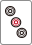
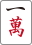
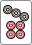

# もっと麻雀が楽しくなる本

## 前書き
皆さんが麻雀で楽しいと感じるときはいつでしょうか。やはりロンやツモで上がったときが一番楽しいのではないでしょうか。（そうでない方はごめんなさい）
この本は麻雀に入門したばかりの方に向けて、上がりの回数を増やすための技術を提示するものです。
本書の内容をもとに、より多くの楽しい経験を積んでいただければ幸いです。

---

## 本書で扱う内容

#### 攻撃面

* 牌理（一番早くテンパイするために捨てる牌を選ぶ技術）
* 最初に覚えると良い役（立直、飜牌、断幺）

## 本書に出てこない内容（需要があれば別の機会に）

#### 攻撃面

* 役作り（上がり点数を一番高くするために捨てる牌を選ぶ技術）
* 鳴き（ポン、チーを実行するべきか判断する技術）

#### 守備面

* ベタオリ（リーチされた際にリーチ者からロンされにくい牌を選択する技術）
* 押し引き（リーチされた際に攻めるべきか守るべきかを判断する技術）

---

## 目次

### 牌理の部
1. 上がりの形
2. 上がり牌の待ちの種類
3. シャンテン数とは
4. 受け入れ枚数の考え方
5. 強いターツと弱いターツ、フォロー牌 
6. イーシャンテン→テンパイが難しい
7. 5ブロックを作ろう
8. 対子は2つがちょうどいい
9. 何切る問題で復習

### 最初に覚えると良い役の部
1. 立直
2. 飜牌
3. 断幺

### 実践の部
1. アプリで復習
2. 練習対局（手配オープンで同卓者と相談しながら）

### 付録
1. 用語の定義一覧
2. 役一覧

---

## 牌理の部
## 上がりの形
#### 牌の組み合わせ方
麻雀は牌を組み合わせて上がりの形を作るゲームです。基本は3枚を1グループとして組み合わせます。グループの種類は、順子と刻子の2種類があります。
「順子または刻子4グループ(=メンツ)」と「同じ種類の牌2枚（=頭）」を揃えると上がりの形となります。

#### 数字を3つ連番で集める 順子（シュンツ）
同じ種類で3つ続きの数字の牌を集めたグループです。
違う種類を含んだり、数字が一巡するものは順子とは認められません。

* OKな例

    
    
    
    すべてが萬子で、なおかつ4,5,6と3つ続きの数字の牌のためOK。

    
    
    
    すべてが索子で、なおかつ1,2,3と3つ続きの数字の牌ためOK。

* NGな例

    
    
    
    2,3,4と3つ続きの数字だが、萬子と筒子が混ざっているためNG

    
    
    
    すべて萬子だが、数字が9から1へ一巡している。9と1はつながらないためNG

    
    
    
    字牌では順子はできないためNG

    
    
    
    字牌では順子はできないためNG

#### 同じ牌を3つ集める 刻子（コーツ）

種類、数字が同じ牌を3つ集めたグループです。
数牌、字牌どちらでも成立します。

* OKな例

    
    
    

    
    
    

    
    
    

    
    
    

#### 上がりの形の例

* 例

    
    
    
    メンツ（順子）
    
    
    
    メンツ（刻子）
    
    
    
    メンツ（順子）
    
    
    
    メンツ（順子）
    
    
    頭

## 上がり牌の待ちの種類
あと1種類の牌が加われば上がりの形ができあがる状態のことを「待ち」、
上がりの形になる牌のことを「待ち牌」と言います。
待ちの形は様々ありますが、基本の形は6種類あります。
形により上がりやすさが異なります。

* 両面待ち（リャンメン待ち）

    
    
    
    メンツ
    
    
    
    メンツ
    
    
    
    メンツ
    
    
    頭
    
    
    両面待ち

    
    か
    
    がくれば4つ目のメンツ（順子）が完成し、上がりの形になります。

* ノベタン待ち

    
    
    
    メンツ
    
    
    
    メンツ
    
    
    
    メンツ
    
    
    
    
    ノベタン待ち

    
    か
    
    がくれば頭が完成し、上がりの形になります。

* 双碰待ち（シャンポン待ち、シャボ待ち）

    
    
    
    メンツ
    
    
    
    メンツ
    
    
    
    メンツ
    
    
    双碰待ち
    
    
    双碰待ち

    
    か
    
    がくれば4つ目のメンツ（刻子）が完成し、上がりの形になります。

* 嵌張待ち（カンチャン待ち）

    
    
    
    メンツ
    
    
    
    メンツ
    
    
    
    メンツ
    
    
    頭
    
    
    嵌張待ち

    
    がくれば4つ目のメンツ（順子）が完成し、上がりの形になります。

* 辺張待ち（ペンチャン待ち）

    
    
    
    メンツ
    
    
    
    メンツ
    
    
    
    メンツ
    
    
    頭
    
    
    辺張待ち

    
    がくれば4つ目のメンツ（順子）が完成し、上がりの形になります。

* 単騎待ち（タンキ待ち）

    
    
    
    メンツ
    
    
    
    メンツ
    
    
    
    メンツ
    
    
    
    メンツ
    
    単騎待ち

    
    がくれば頭が完成し、上がりの形になります。

* 待ちの上がりやすさ
待ちによって上がりやすさが変わります。両面が一番上がりやすいので、両面を優先して残すようにしましょう。

|待ちの種類|待ち牌の種類と枚数|
|:---|--:|
|両面待ち|2種類8枚|
|ノベタン待ち|2種類6枚|
|双碰待ち|2種類4枚|
|嵌張待ち|1種類4枚|
|辺張待ち|1種類4枚|
|単騎待ち|1種類3枚|

### シャンテン数とは
上がりの形を完成させるために必要な牌の枚数を意味します。

## 役の部
まだ

---

### 牌の画像出典
麻雀豆腐様が公開している素材を利用させて頂きました。

http://majandofu.com/mahjong-images